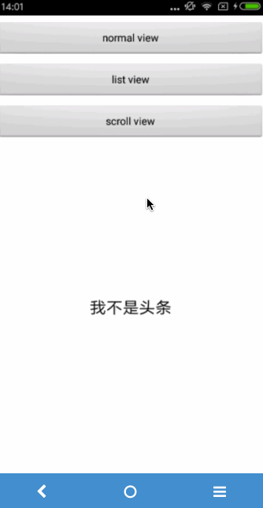
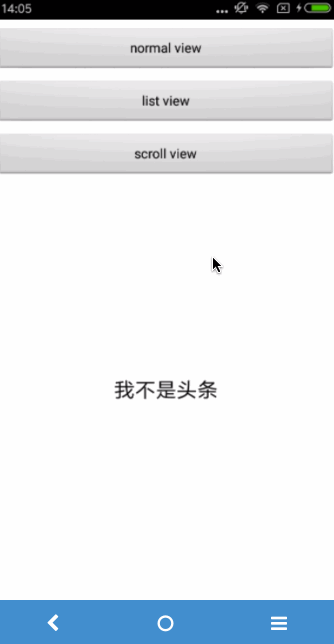
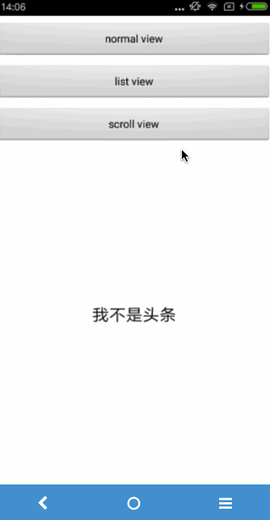

##### Welcome to visit:
Github: https://github.com/lorienzhang

Blog: http://blog.csdn.net/h_zhang

---

# SwipeFinishLayout
仿今日头条评论详情页滑动退出效果

## 效果图
### Normal View

	

---

### AbsListView

        

---

### ScrollView

        

## 使用方法

* 想要让Activity具有滑动退出的效果，只需要继承SwipeFinishActivity即可；
* 目前可以支持ContentView为普通的View（比如TextView,ImageView），ListView，GridView，ScrollView；

## 未完待续~~~

